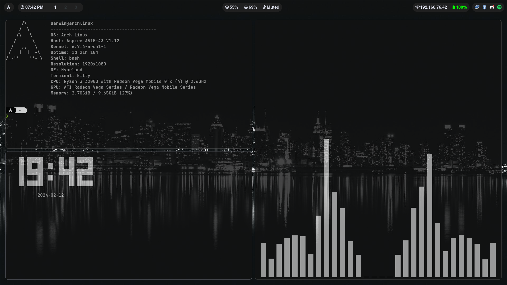

#  _   _                  _                 _  
# | | | |_   _ _ __  _ __| | __ _ _ __   __| | 
# | |_| | | | | '_ \| '__| |/ _` | '_ \ / _` | 
# |  _  | |_| | |_) | |  | | (_| | | | | (_| | 
# |_| |_|\__, | .__/|_|  |_|\__,_|_| |_|\__,_| 
#        |___/|_|                              
# 
# Config by @darwincereska
# https://github.com/darwincereska/hyprland
This Hyprland Config/Installer has a bunch of amazing keybinds, good performance, and preinstalled software


## Software Included

- Pre-Configured Waybar with Animations
- Hyprland DE and WM
- Waypaper for Wallpapers
- swwm
- Sublime Text
- Neofetch
- Firefox
- SwayBG and Swaylock
- Wofi Application Launcher
- Starship Shell Prompt
- Hyprshot Screenshot Tool
- tty-clock a Simple Terminal Clock
- GTOP and HTOP terminal system monitor 


## Requisites
- You need to have `Arch Linux`
- You need to have `sudo` access
- The software `Yay` and `Git` has to be installed for this to work
## Installation

Clone the Repository with `git`

```bash
  git clone https://github.com/darwincereska/hyprland.git
```
    

Move into the directory with `cd`

``` bash
    cd hyprland
```

Give permissions to the `set-hypr` script

``` bash
    sudo chmod +x set-hypr
```

Run the script

``` bash
    ./set-hypr
```    
- It will ask you if you want to install dependencies. Respond with  `y`

- Then, it will ask if you want to copy the configs. Respond with `y`

- Continue with the prompts after and install Starship

- It will ask if you want to start hyprland say `y`

- If you reboot your pc, you will need to start Hyprland again. Type this and press `enter`

``` bash
    Hyprland
```
## FAQ
#### How do I get neofetch on my terminal when I open it?

Go into the cloned folder and do `cp .bashrc ~/`


#### How do I open apps?

The default keybind to open the application manager is `SUPER(or Windows Key) + SPACE`


#### How do I edit the configs

All Config files for Hyprland or from this git repo is in `~/.config/`

``` bash
    cd ~/.config
```

To edit the files you can use `nano` or    `subl`

``` bash
    nano <file>
```
Or 
``` bash
    subl <folder> or <file>
```
#### How Do I Change The Wallpaper
Open the Application Launcer `SUPER + SPACE`

and Search: `Waypaper`

Set the folder to `~/Backgrounds`, and choose an image.

#### How do I close an App

The default keybind is `SUPER + SHIFT + X`


